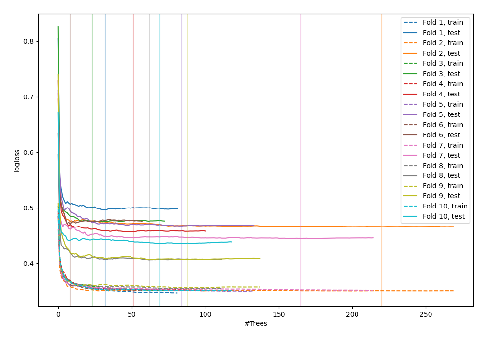
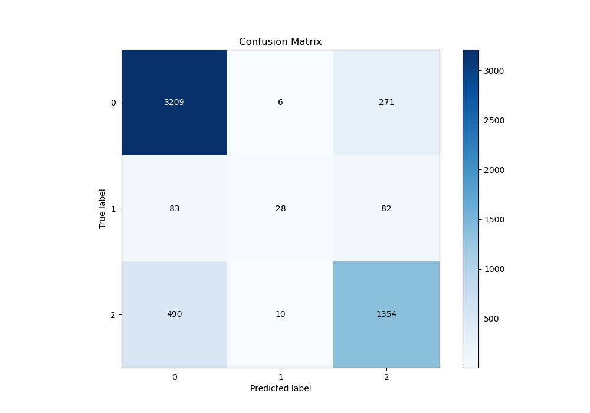
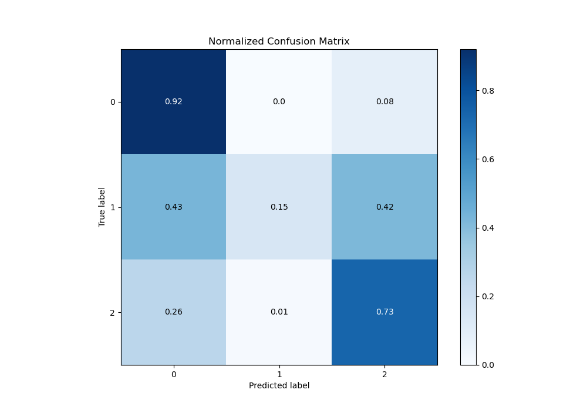
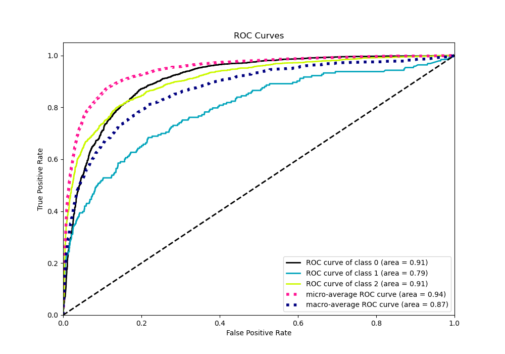
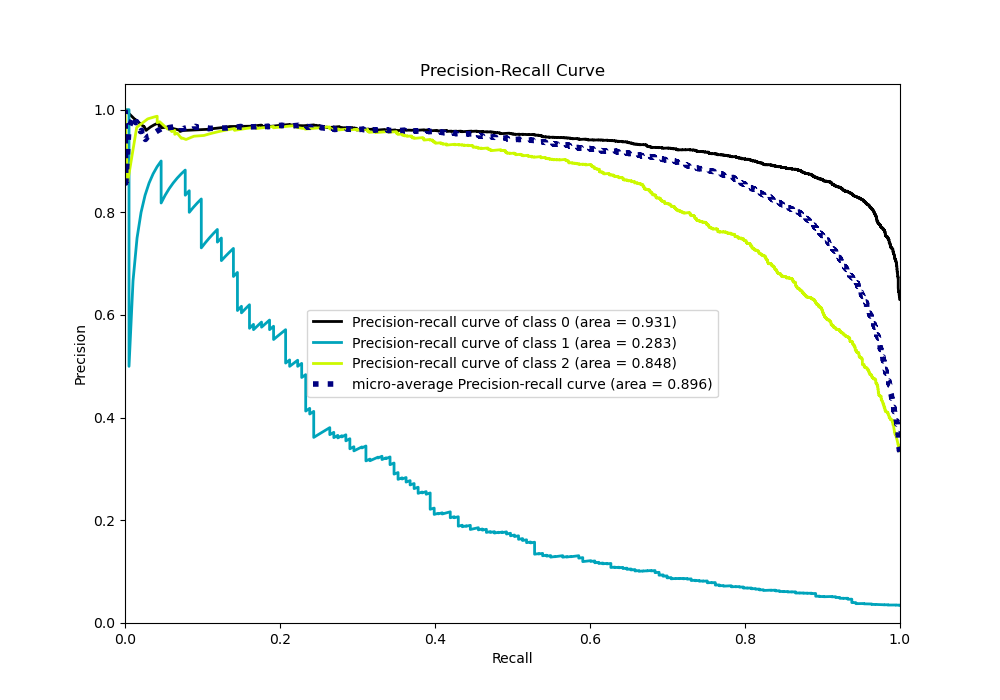

# Summary of 90_RandomForest_SelectedFeatures_Stacked

[<< Go back](../README.md)

## Random Forest
- **n_jobs**: -1
- **criterion**: gini
- **max_features**: 0.6
- **min_samples_split**: 30
- **max_depth**: 7
- **eval_metric_name**: logloss
- **num_class**: 3
- **explain_level**: 0

## Validation
 - **validation_type**: kfold
 - **shuffle**: True
 - **stratify**: True
 - **k_folds**: 10

## Optimized metric
logloss

## Training time

153.6 seconds

### Metric details
|           |           0 |          1 |           2 |   accuracy |   macro avg |   weighted avg |   logloss |
|:----------|------------:|-----------:|------------:|-----------:|------------:|---------------:|----------:|
| precision |    0.848493 |   0.636364 |    0.793204 |   0.829749 |    0.759354 |       0.822567 |  0.452484 |
| recall    |    0.920539 |   0.145078 |    0.730313 |   0.829749 |    0.598643 |       0.829749 |  0.452484 |
| f1-score  |    0.883049 |   0.236287 |    0.760461 |   0.829749 |    0.626599 |       0.819412 |  0.452484 |
| support   | 3486        | 193        | 1854        |   0.829749 | 5533        |    5533        |  0.452484 |

## Confusion matrix
|              |   Predicted as 0 |   Predicted as 1 |   Predicted as 2 |
|:-------------|-----------------:|-----------------:|-----------------:|
| Labeled as 0 |             3209 |                6 |              271 |
| Labeled as 1 |               83 |               28 |               82 |
| Labeled as 2 |              490 |               10 |             1354 |

## Learning curves

## Confusion Matrix

## Normalized Confusion Matrix

## ROC Curve

## Precision Recall Curve

[<< Go back](../README.md)
