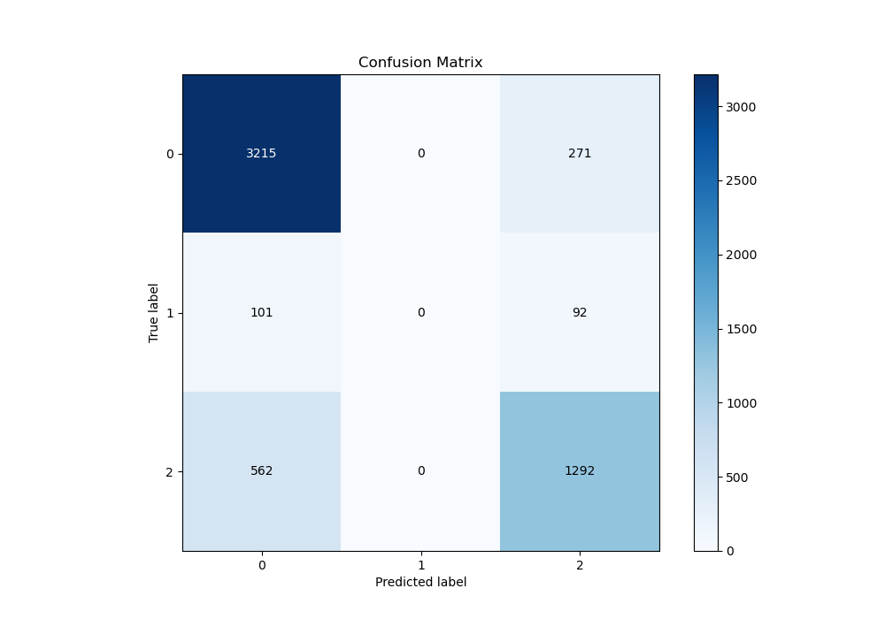

# Summary of 92_RandomForest

[<< Go back](../README.md)

## Random Forest
- **n_jobs**: -1
- **criterion**: entropy
- **max_features**: 0.5
- **min_samples_split**: 50
- **max_depth**: 6
- **eval_metric_name**: logloss
- **num_class**: 3
- **explain_level**: 0

## Validation
 - **validation_type**: kfold
 - **shuffle**: True
 - **stratify**: True
 - **k_folds**: 10

## Optimized metric
logloss

## Training time

22.5 seconds

### Metric details
|           |           0 |   1 |           2 |   accuracy |   macro avg |   weighted avg |   logloss |
|:----------|------------:|----:|------------:|-----------:|------------:|---------------:|----------:|
| precision |    0.829036 |   0 |    0.780665 |   0.814567 |    0.536567 |       0.783909 |  0.486515 |
| recall    |    0.92226  |   0 |    0.696872 |   0.814567 |    0.539711 |       0.814567 |  0.486515 |
| f1-score  |    0.873167 |   0 |    0.736392 |   0.814567 |    0.53652  |       0.796879 |  0.486515 |
| support   | 3486        | 193 | 1854        |   0.814567 | 5533        |    5533        |  0.486515 |

## Confusion matrix
|              |   Predicted as 0 |   Predicted as 1 |   Predicted as 2 |
|:-------------|-----------------:|-----------------:|-----------------:|
| Labeled as 0 |             3215 |                0 |              271 |
| Labeled as 1 |              101 |                0 |               92 |
| Labeled as 2 |              562 |                0 |             1292 |

## Learning curves

## Confusion Matrix

## Normalized Confusion Matrix

## ROC Curve

## Precision Recall Curve

[<< Go back](../README.md)
