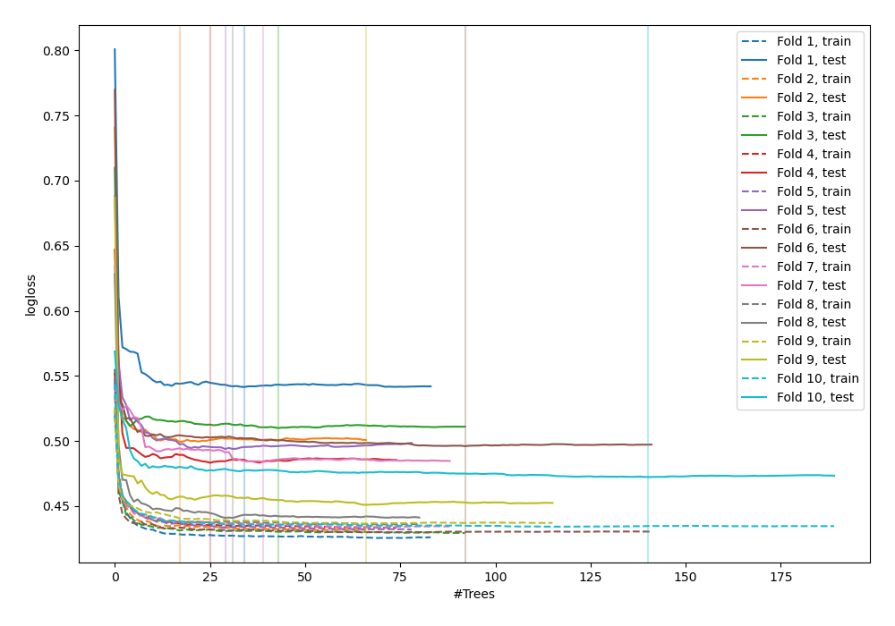
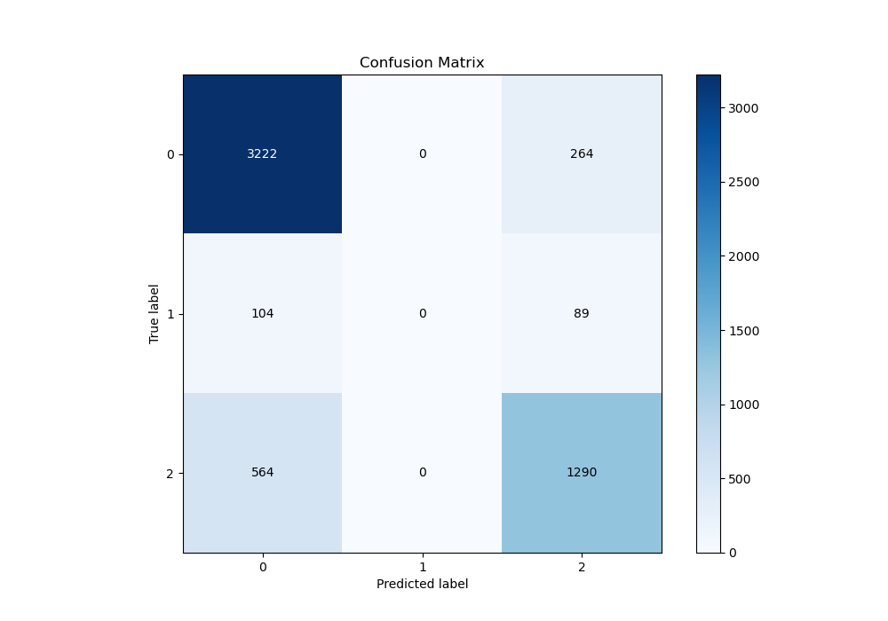
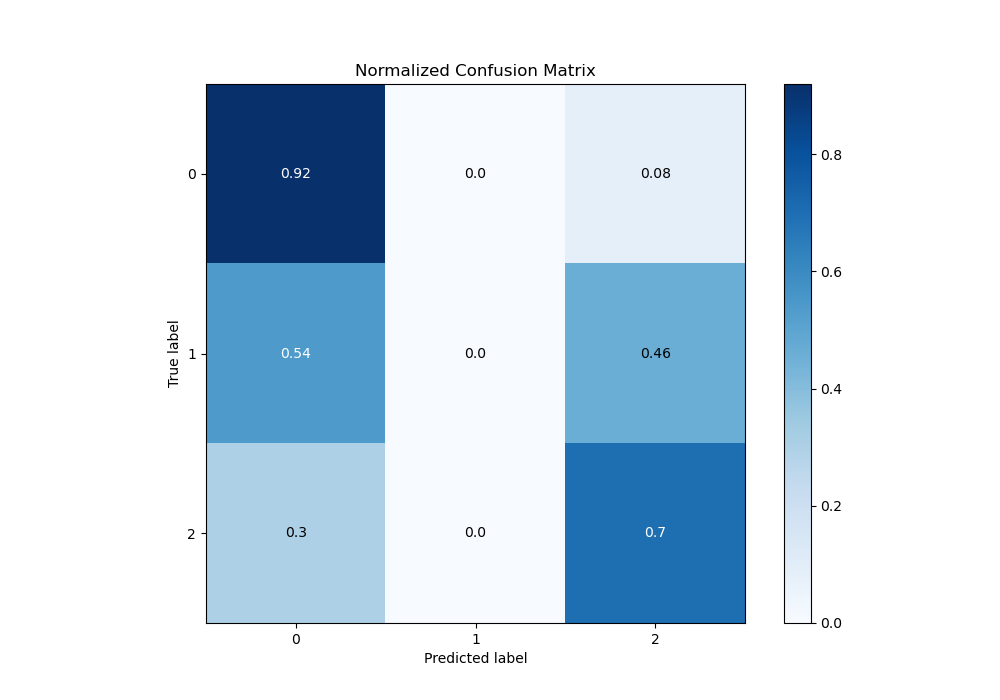
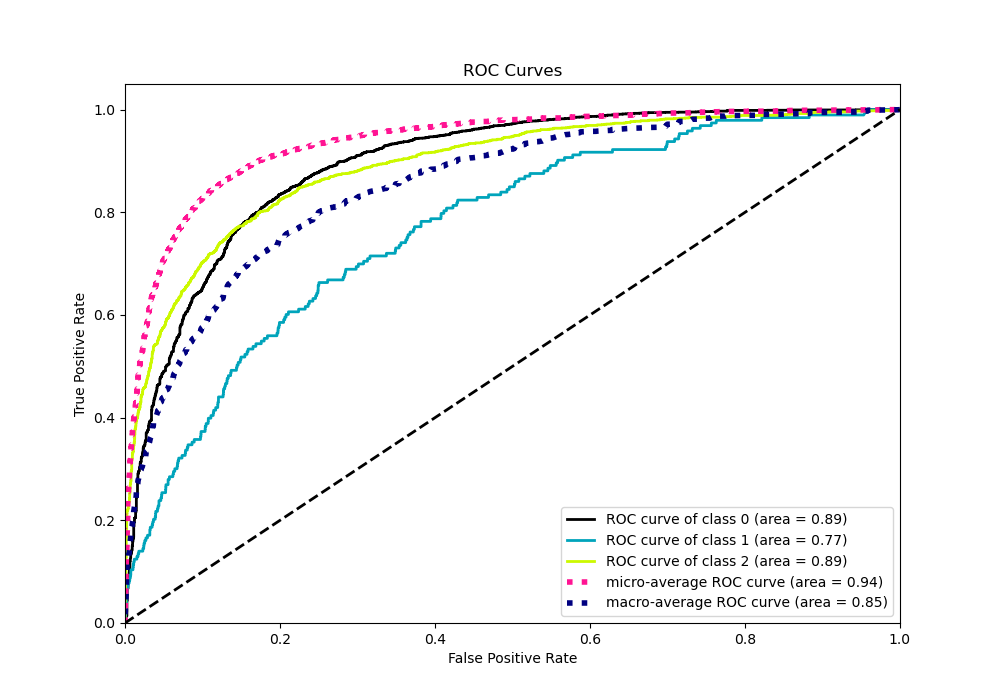
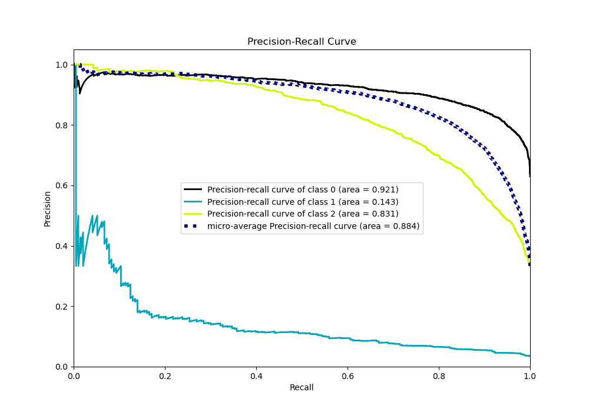

# Summary of 93_RandomForest

[<< Go back](../README.md)

## Random Forest
- **n_jobs**: -1
- **criterion**: entropy
- **max_features**: 0.7
- **min_samples_split**: 50
- **max_depth**: 6
- **eval_metric_name**: logloss
- **num_class**: 3
- **explain_level**: 0

## Validation
 - **validation_type**: kfold
 - **shuffle**: True
 - **stratify**: True
 - **k_folds**: 10

## Optimized metric
logloss

## Training time

16.7 seconds

### Metric details
|           |           0 |   1 |           2 |   accuracy |   macro avg |   weighted avg |   logloss |
|:----------|------------:|----:|------------:|-----------:|------------:|---------------:|----------:|
| precision |    0.828278 |   0 |    0.785149 |   0.815471 |    0.537809 |       0.784934 |  0.487214 |
| recall    |    0.924269 |   0 |    0.695793 |   0.815471 |    0.54002  |       0.815471 |  0.487214 |
| f1-score  |    0.873644 |   0 |    0.737775 |   0.815471 |    0.53714  |       0.797643 |  0.487214 |
| support   | 3486        | 193 | 1854        |   0.815471 | 5533        |    5533        |  0.487214 |

## Confusion matrix
|              |   Predicted as 0 |   Predicted as 1 |   Predicted as 2 |
|:-------------|-----------------:|-----------------:|-----------------:|
| Labeled as 0 |             3222 |                0 |              264 |
| Labeled as 1 |              104 |                0 |               89 |
| Labeled as 2 |              564 |                0 |             1290 |

## Learning curves

## Confusion Matrix

## Normalized Confusion Matrix

## ROC Curve

## Precision Recall Curve

[<< Go back](../README.md)
