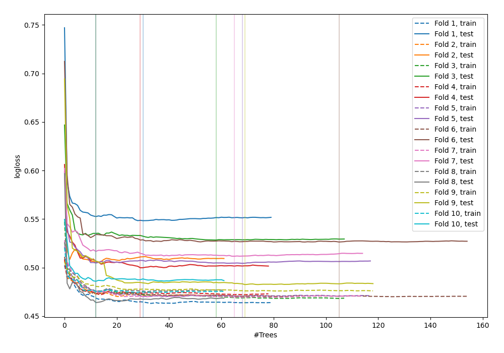
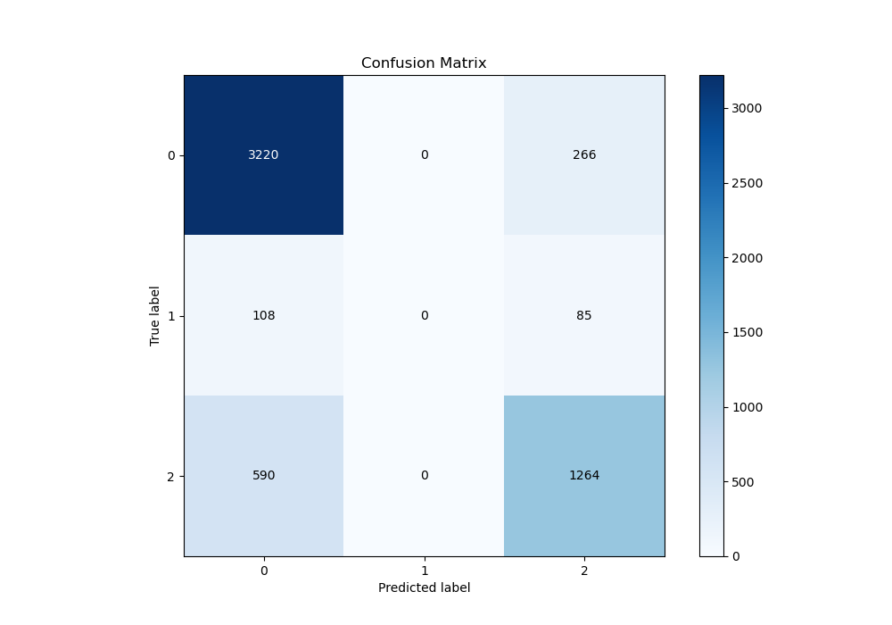
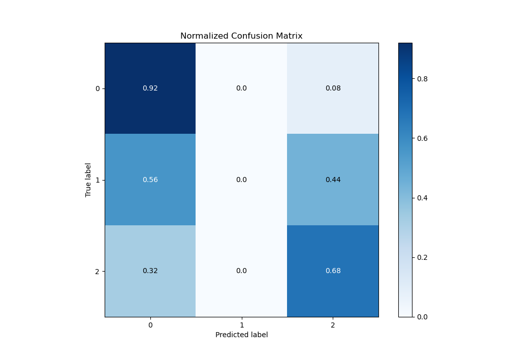
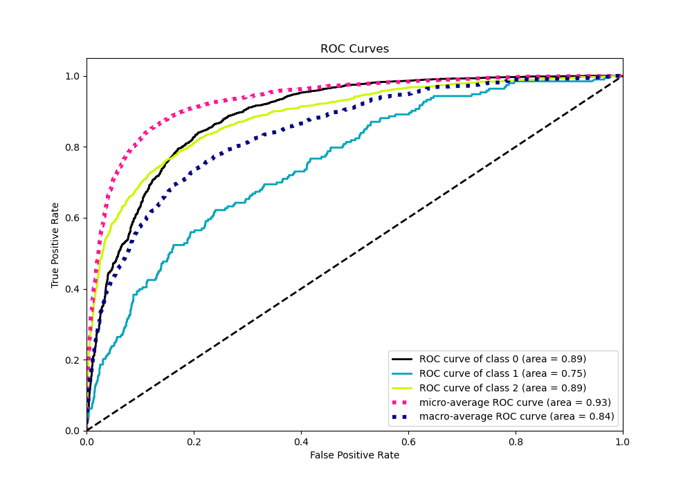
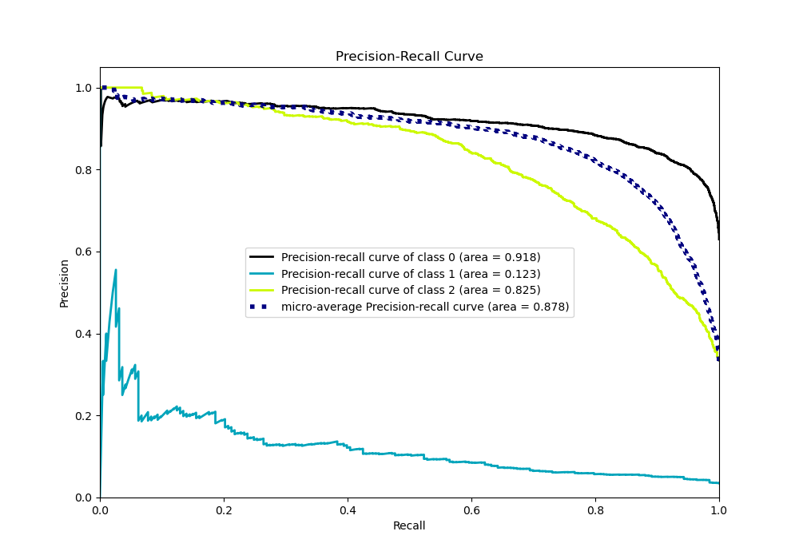

# Summary of 94_ExtraTrees_SelectedFeatures

[<< Go back](../README.md)

## Extra Trees Classifier (Extra Trees)
- **n_jobs**: -1
- **criterion**: gini
- **max_features**: 0.9
- **min_samples_split**: 40
- **max_depth**: 7
- **eval_metric_name**: logloss
- **num_class**: 3
- **explain_level**: 0

## Validation
 - **validation_type**: kfold
 - **shuffle**: True
 - **stratify**: True
 - **k_folds**: 10

## Optimized metric
logloss

## Training time

14.8 seconds

### Metric details
|           |           0 |   1 |           2 |   accuracy |   macro avg |   weighted avg |   logloss |
|:----------|------------:|----:|------------:|-----------:|------------:|---------------:|----------:|
| precision |    0.821848 |   0 |    0.782663 |    0.81041 |    0.534837 |       0.78005  |  0.505672 |
| recall    |    0.923695 |   0 |    0.681769 |    0.81041 |    0.535155 |       0.81041  |  0.505672 |
| f1-score  |    0.8698   |   0 |    0.72874  |    0.81041 |    0.532847 |       0.792194 |  0.505672 |
| support   | 3486        | 193 | 1854        |    0.81041 | 5533        |    5533        |  0.505672 |

## Confusion matrix
|              |   Predicted as 0 |   Predicted as 1 |   Predicted as 2 |
|:-------------|-----------------:|-----------------:|-----------------:|
| Labeled as 0 |             3220 |                0 |              266 |
| Labeled as 1 |              108 |                0 |               85 |
| Labeled as 2 |              590 |                0 |             1264 |

## Learning curves

## Confusion Matrix

## Normalized Confusion Matrix

## ROC Curve

## Precision Recall Curve

[<< Go back](../README.md)
