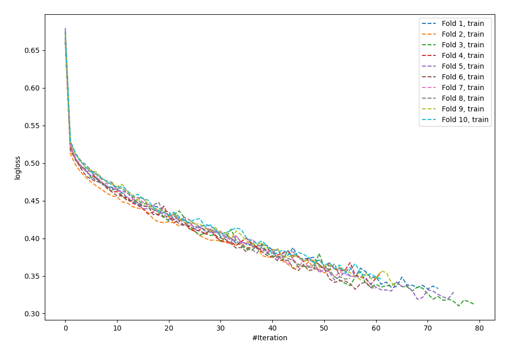
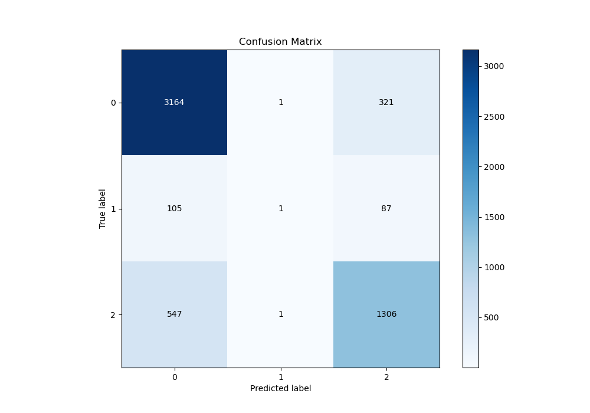
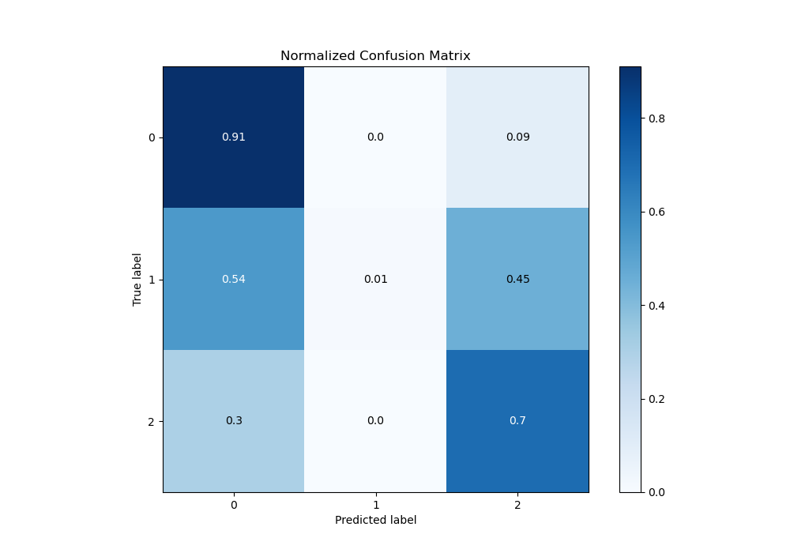
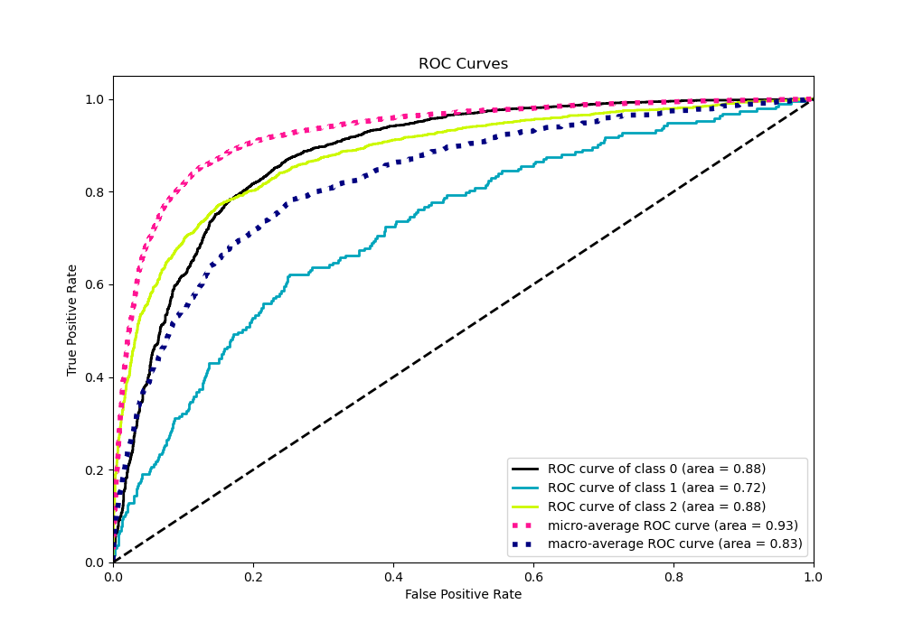
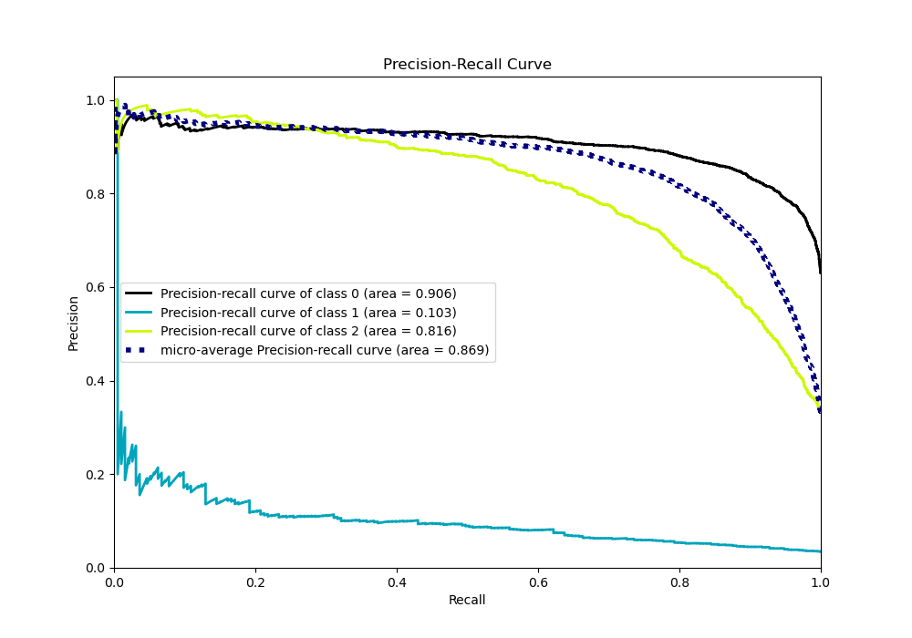

# Summary of 99_NeuralNetwork_SelectedFeatures

[<< Go back](../README.md)

## Neural Network
- **n_jobs**: -1
- **dense_1_size**: 64
- **dense_2_size**: 8
- **learning_rate**: 0.01
- **num_class**: 3
- **explain_level**: 0

## Validation
 - **validation_type**: kfold
 - **shuffle**: True
 - **stratify**: True
 - **k_folds**: 10

## Optimized metric
logloss

## Training time

17.3 seconds

### Metric details
|           |           0 |            1 |           2 |   accuracy |   macro avg |   weighted avg |   logloss |
|:----------|------------:|-------------:|------------:|-----------:|------------:|---------------:|----------:|
| precision |    0.82914  |   0.333333   |    0.76196  |   0.808061 |    0.641478 |       0.789335 |  0.518632 |
| recall    |    0.907631 |   0.00518135 |    0.704423 |   0.808061 |    0.539078 |       0.808061 |  0.518632 |
| f1-score  |    0.866612 |   0.0102041  |    0.732063 |   0.808061 |    0.536293 |       0.791654 |  0.518632 |
| support   | 3486        | 193          | 1854        |   0.808061 | 5533        |    5533        |  0.518632 |

## Confusion matrix
|              |   Predicted as 0 |   Predicted as 1 |   Predicted as 2 |
|:-------------|-----------------:|-----------------:|-----------------:|
| Labeled as 0 |             3164 |                1 |              321 |
| Labeled as 1 |              105 |                1 |               87 |
| Labeled as 2 |              547 |                1 |             1306 |

## Learning curves

## Confusion Matrix

## Normalized Confusion Matrix

## ROC Curve

## Precision Recall Curve

[<< Go back](../README.md)
