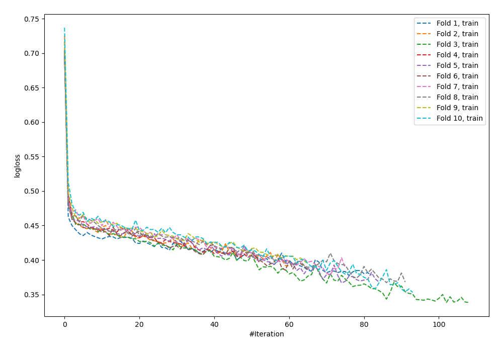

# Summary of 99_NeuralNetwork_SelectedFeatures_Stacked

[<< Go back](../README.md)

## Neural Network
- **n_jobs**: -1
- **dense_1_size**: 64
- **dense_2_size**: 8
- **learning_rate**: 0.01
- **num_class**: 3
- **explain_level**: 0

## Validation
 - **validation_type**: kfold
 - **shuffle**: True
 - **stratify**: True
 - **k_folds**: 10

## Optimized metric
logloss

## Training time

28.0 seconds

### Metric details
|           |           0 |          1 |           2 |   accuracy |   macro avg |   weighted avg |   logloss |
|:----------|------------:|-----------:|------------:|-----------:|------------:|---------------:|----------:|
| precision |    0.852313 |   0.538462 |    0.772422 |   0.823604 |    0.721065 |       0.814595 |  0.476933 |
| recall    |    0.903901 |   0.145078 |    0.743258 |   0.823604 |    0.597412 |       0.823604 |  0.476933 |
| f1-score  |    0.877349 |   0.228571 |    0.757559 |   0.823604 |    0.62116  |       0.81458  |  0.476933 |
| support   | 3486        | 193        | 1854        |   0.823604 | 5533        |    5533        |  0.476933 |

## Confusion matrix
|              |   Predicted as 0 |   Predicted as 1 |   Predicted as 2 |
|:-------------|-----------------:|-----------------:|-----------------:|
| Labeled as 0 |             3151 |               11 |              324 |
| Labeled as 1 |               83 |               28 |               82 |
| Labeled as 2 |              463 |               13 |             1378 |

## Learning curves

## Confusion Matrix

## Normalized Confusion Matrix

## ROC Curve

## Precision Recall Curve

[<< Go back](../README.md)
