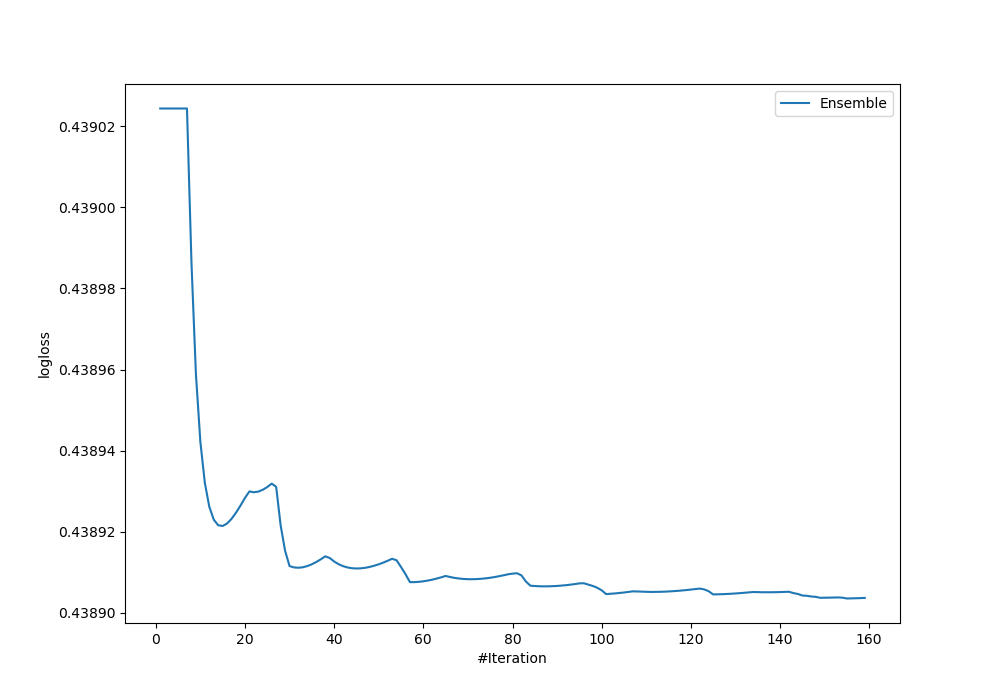
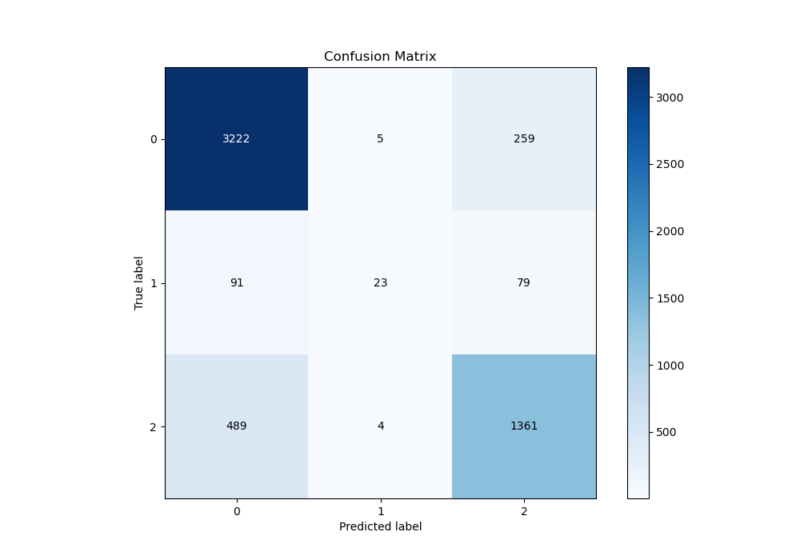
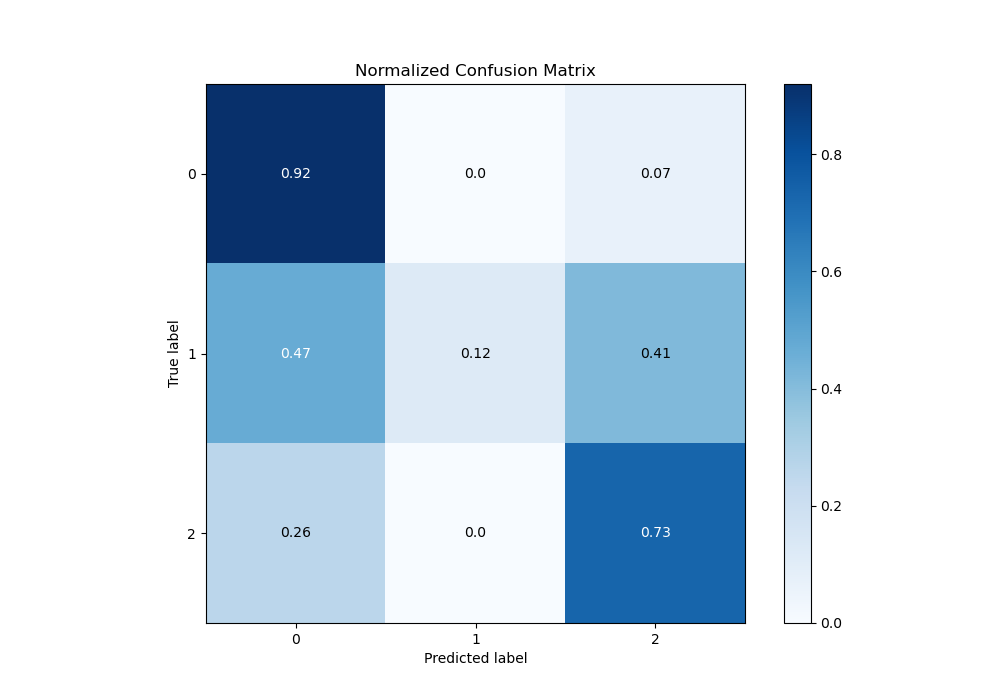
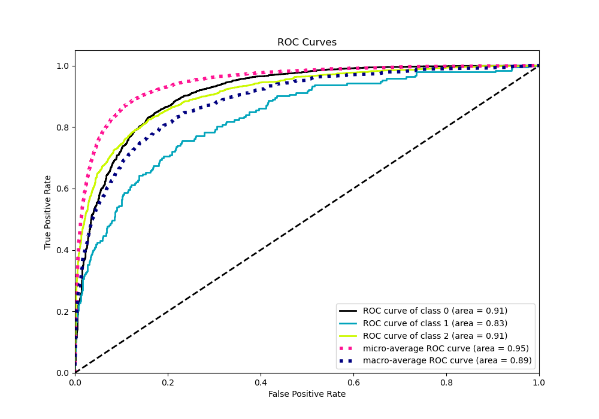
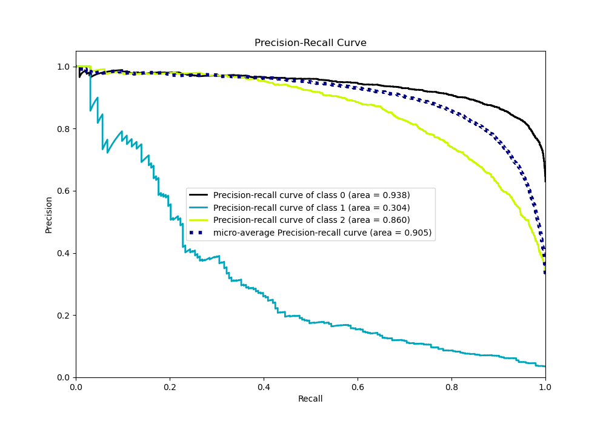

# Summary of Ensemble_Stacked

[<< Go back](../README.md)

## Ensemble structure
| Model                                   |   Weight |
|:----------------------------------------|---------:|
| 116_ExtraTrees_SelectedFeatures_Stacked |        3 |
| 14_Xgboost_Stacked                      |       11 |
| 15_Xgboost                              |        3 |
| 17_Xgboost                              |        1 |
| 17_Xgboost_KMeansFeatures               |        2 |
| 22_LightGBM                             |        7 |
| 25_LightGBM                             |        8 |
| 77_Xgboost                              |        4 |
| 81_LightGBM                             |        1 |
| Ensemble                                |      115 |

### Metric details
|           |           0 |          1 |           2 |   accuracy |   macro avg |   weighted avg |   logloss |
|:----------|------------:|-----------:|------------:|-----------:|------------:|---------------:|----------:|
| precision |    0.847449 |   0.71875  |    0.801059 |    0.83246 |    0.789086 |       0.827415 |  0.438904 |
| recall    |    0.924269 |   0.119171 |    0.734088 |    0.83246 |    0.592509 |       0.83246  |  0.438904 |
| f1-score  |    0.884193 |   0.204444 |    0.766113 |    0.83246 |    0.61825  |       0.820916 |  0.438904 |
| support   | 3486        | 193        | 1854        |    0.83246 | 5533        |    5533        |  0.438904 |

## Confusion matrix
|              |   Predicted as 0 |   Predicted as 1 |   Predicted as 2 |
|:-------------|-----------------:|-----------------:|-----------------:|
| Labeled as 0 |             3222 |                5 |              259 |
| Labeled as 1 |               91 |               23 |               79 |
| Labeled as 2 |              489 |                4 |             1361 |

## Learning curves

## Confusion Matrix

## Normalized Confusion Matrix

## ROC Curve

## Precision Recall Curve

[<< Go back](../README.md)
