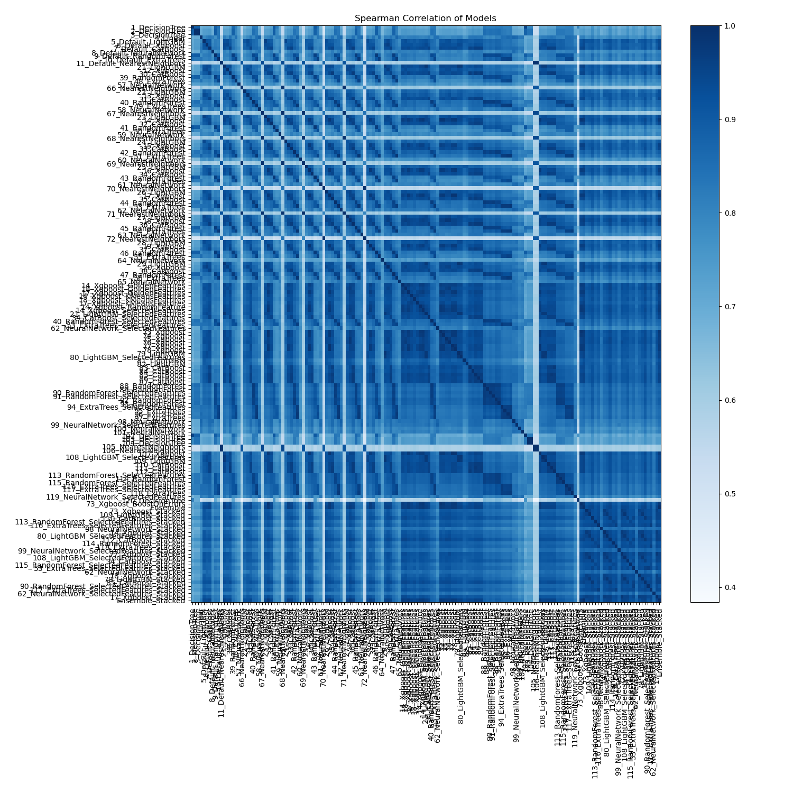

# AutoML Leaderboard

| Best model   | name                                                                                             | model_type        | metric_type   |   metric_value |   train_time |
|:-------------|:-------------------------------------------------------------------------------------------------|:------------------|:--------------|---------------:|-------------:|
|              | [1_DecisionTree](1_DecisionTree/README.md)                                                       | Decision Tree     | logloss       |       0.532945 |         2.12 |
|              | [2_DecisionTree](2_DecisionTree/README.md)                                                       | Decision Tree     | logloss       |       0.538758 |         2    |
|              | [3_DecisionTree](3_DecisionTree/README.md)                                                       | Decision Tree     | logloss       |       0.538758 |         2.02 |
|              | [4_Linear](4_Linear/README.md)                                                                   | Linear            | logloss       |       0.53319  |        10.5  |
|              | [5_Default_LightGBM](5_Default_LightGBM/README.md)                                               | LightGBM          | logloss       |       0.461241 |        10.72 |
|              | [6_Default_Xgboost](6_Default_Xgboost/README.md)                                                 | Xgboost           | logloss       |       0.459219 |         8.67 |
|              | [7_Default_CatBoost](7_Default_CatBoost/README.md)                                               | CatBoost          | logloss       |       0.457631 |        10.43 |
|              | [8_Default_NeuralNetwork](8_Default_NeuralNetwork/README.md)                                     | Neural Network    | logloss       |       0.535415 |        11.98 |
|              | [9_Default_RandomForest](9_Default_RandomForest/README.md)                                       | Random Forest     | logloss       |       0.506294 |        14.53 |
|              | [10_Default_ExtraTrees](10_Default_ExtraTrees/README.md)                                         | Extra Trees       | logloss       |       0.53733  |        10.81 |
|              | [11_Default_NearestNeighbors](11_Default_NearestNeighbors/README.md)                             | Nearest Neighbors | logloss       |       1.33113  |         3.71 |
|              | [21_LightGBM](21_LightGBM/README.md)                                                             | LightGBM          | logloss       |       0.450967 |         7.55 |
|              | [12_Xgboost](12_Xgboost/README.md)                                                               | Xgboost           | logloss       |       0.464065 |         9.88 |
|              | [30_CatBoost](30_CatBoost/README.md)                                                             | CatBoost          | logloss       |       0.457547 |        10.09 |
|              | [39_RandomForest](39_RandomForest/README.md)                                                     | Random Forest     | logloss       |       0.503219 |        12.43 |
|              | [48_ExtraTrees](48_ExtraTrees/README.md)                                                         | Extra Trees       | logloss       |       0.55609  |         9.78 |
|              | [57_NeuralNetwork](57_NeuralNetwork/README.md)                                                   | Neural Network    | logloss       |       0.541483 |        12.9  |
|              | [66_NearestNeighbors](66_NearestNeighbors/README.md)                                             | Nearest Neighbors | logloss       |       1.15185  |         3.74 |
|              | [22_LightGBM](22_LightGBM/README.md)                                                             | LightGBM          | logloss       |       0.457489 |         7.15 |
|              | [13_Xgboost](13_Xgboost/README.md)                                                               | Xgboost           | logloss       |       0.471247 |        10.23 |
|              | [31_CatBoost](31_CatBoost/README.md)                                                             | CatBoost          | logloss       |       0.460249 |        10.49 |
|              | [40_RandomForest](40_RandomForest/README.md)                                                     | Random Forest     | logloss       |       0.482394 |        16.05 |
|              | [49_ExtraTrees](49_ExtraTrees/README.md)                                                         | Extra Trees       | logloss       |       0.508562 |        12.08 |
|              | [58_NeuralNetwork](58_NeuralNetwork/README.md)                                                   | Neural Network    | logloss       |       0.528821 |        13.21 |
|              | [67_NearestNeighbors](67_NearestNeighbors/README.md)                                             | Nearest Neighbors | logloss       |       1.14968  |         4.24 |
|              | [23_LightGBM](23_LightGBM/README.md)                                                             | LightGBM          | logloss       |       0.462077 |        11.04 |
|              | [14_Xgboost](14_Xgboost/README.md)                                                               | Xgboost           | logloss       |       0.446651 |         9.16 |
|              | [32_CatBoost](32_CatBoost/README.md)                                                             | CatBoost          | logloss       |       0.459245 |        10.8  |
|              | [41_RandomForest](41_RandomForest/README.md)                                                     | Random Forest     | logloss       |       0.518895 |        13.81 |
|              | [50_ExtraTrees](50_ExtraTrees/README.md)                                                         | Extra Trees       | logloss       |       0.557181 |         8.6  |
|              | [59_NeuralNetwork](59_NeuralNetwork/README.md)                                                   | Neural Network    | logloss       |       0.536725 |        13.89 |
|              | [68_NearestNeighbors](68_NearestNeighbors/README.md)                                             | Nearest Neighbors | logloss       |       1.14968  |         4.57 |
|              | [24_LightGBM](24_LightGBM/README.md)                                                             | LightGBM          | logloss       |       0.473534 |        13.32 |
|              | [15_Xgboost](15_Xgboost/README.md)                                                               | Xgboost           | logloss       |       0.453478 |         8.16 |
|              | [33_CatBoost](33_CatBoost/README.md)                                                             | CatBoost          | logloss       |       0.461453 |        12.48 |
|              | [42_RandomForest](42_RandomForest/README.md)                                                     | Random Forest     | logloss       |       0.486462 |        13.68 |
|              | [51_ExtraTrees](51_ExtraTrees/README.md)                                                         | Extra Trees       | logloss       |       0.525199 |        15.68 |
|              | [60_NeuralNetwork](60_NeuralNetwork/README.md)                                                   | Neural Network    | logloss       |       0.561438 |        14.41 |
|              | [69_NearestNeighbors](69_NearestNeighbors/README.md)                                             | Nearest Neighbors | logloss       |       1.15185  |         4.72 |
|              | [25_LightGBM](25_LightGBM/README.md)                                                             | LightGBM          | logloss       |       0.451488 |         8.08 |
|              | [16_Xgboost](16_Xgboost/README.md)                                                               | Xgboost           | logloss       |       0.451553 |        10.32 |
|              | [34_CatBoost](34_CatBoost/README.md)                                                             | CatBoost          | logloss       |       0.455583 |        10.6  |
|              | [43_RandomForest](43_RandomForest/README.md)                                                     | Random Forest     | logloss       |       0.518057 |        14.63 |
|              | [52_ExtraTrees](52_ExtraTrees/README.md)                                                         | Extra Trees       | logloss       |       0.568478 |        12.52 |
|              | [61_NeuralNetwork](61_NeuralNetwork/README.md)                                                   | Neural Network    | logloss       |       0.539436 |        15.51 |
|              | [70_NearestNeighbors](70_NearestNeighbors/README.md)                                             | Nearest Neighbors | logloss       |       1.76793  |         5.22 |
|              | [26_LightGBM](26_LightGBM/README.md)                                                             | LightGBM          | logloss       |       0.451788 |        15.67 |
|              | [17_Xgboost](17_Xgboost/README.md)                                                               | Xgboost           | logloss       |       0.447722 |        10.78 |
|              | [35_CatBoost](35_CatBoost/README.md)                                                             | CatBoost          | logloss       |       0.458361 |        11    |
|              | [44_RandomForest](44_RandomForest/README.md)                                                     | Random Forest     | logloss       |       0.486692 |        19.44 |
|              | [53_ExtraTrees](53_ExtraTrees/README.md)                                                         | Extra Trees       | logloss       |       0.505747 |        15.98 |
|              | [62_NeuralNetwork](62_NeuralNetwork/README.md)                                                   | Neural Network    | logloss       |       0.521398 |        15.2  |
|              | [71_NearestNeighbors](71_NearestNeighbors/README.md)                                             | Nearest Neighbors | logloss       |       1.15185  |         5.32 |
|              | [27_LightGBM](27_LightGBM/README.md)                                                             | LightGBM          | logloss       |       0.459227 |        12.74 |
|              | [18_Xgboost](18_Xgboost/README.md)                                                               | Xgboost           | logloss       |       0.447275 |        13.21 |
|              | [36_CatBoost](36_CatBoost/README.md)                                                             | CatBoost          | logloss       |       0.457327 |        14.94 |
|              | [45_RandomForest](45_RandomForest/README.md)                                                     | Random Forest     | logloss       |       0.49597  |        16.23 |
|              | [54_ExtraTrees](54_ExtraTrees/README.md)                                                         | Extra Trees       | logloss       |       0.526185 |        18.24 |
|              | [63_NeuralNetwork](63_NeuralNetwork/README.md)                                                   | Neural Network    | logloss       |       0.525612 |        14.43 |
|              | [72_NearestNeighbors](72_NearestNeighbors/README.md)                                             | Nearest Neighbors | logloss       |       1.76832  |         5.91 |
|              | [28_LightGBM](28_LightGBM/README.md)                                                             | LightGBM          | logloss       |       0.456705 |         8.98 |
|              | [19_Xgboost](19_Xgboost/README.md)                                                               | Xgboost           | logloss       |       0.452536 |        11.27 |
|              | [37_CatBoost](37_CatBoost/README.md)                                                             | CatBoost          | logloss       |       0.459038 |         9.92 |
|              | [46_RandomForest](46_RandomForest/README.md)                                                     | Random Forest     | logloss       |       0.503553 |        15.37 |
|              | [55_ExtraTrees](55_ExtraTrees/README.md)                                                         | Extra Trees       | logloss       |       0.554967 |        19.5  |
|              | [64_NeuralNetwork](64_NeuralNetwork/README.md)                                                   | Neural Network    | logloss       |       0.562    |        16.24 |
|              | [29_LightGBM](29_LightGBM/README.md)                                                             | LightGBM          | logloss       |       0.453147 |         9.95 |
|              | [20_Xgboost](20_Xgboost/README.md)                                                               | Xgboost           | logloss       |       0.454399 |        15.12 |
|              | [38_CatBoost](38_CatBoost/README.md)                                                             | CatBoost          | logloss       |       0.460473 |        17.97 |
|              | [47_RandomForest](47_RandomForest/README.md)                                                     | Random Forest     | logloss       |       0.494268 |        17.12 |
|              | [56_ExtraTrees](56_ExtraTrees/README.md)                                                         | Extra Trees       | logloss       |       0.540911 |        15.66 |
|              | [65_NeuralNetwork](65_NeuralNetwork/README.md)                                                   | Neural Network    | logloss       |       0.541199 |        15.81 |
|              | [14_Xgboost_GoldenFeatures](14_Xgboost_GoldenFeatures/README.md)                                 | Xgboost           | logloss       |       0.453055 |        21.95 |
|              | [18_Xgboost_GoldenFeatures](18_Xgboost_GoldenFeatures/README.md)                                 | Xgboost           | logloss       |       0.456344 |        16.81 |
|              | [17_Xgboost_GoldenFeatures](17_Xgboost_GoldenFeatures/README.md)                                 | Xgboost           | logloss       |       0.451345 |        12.27 |
|              | [14_Xgboost_KMeansFeatures](14_Xgboost_KMeansFeatures/README.md)                                 | Xgboost           | logloss       |       0.457336 |        16.71 |
|              | [18_Xgboost_KMeansFeatures](18_Xgboost_KMeansFeatures/README.md)                                 | Xgboost           | logloss       |       0.462368 |        21.33 |
|              | [17_Xgboost_KMeansFeatures](17_Xgboost_KMeansFeatures/README.md)                                 | Xgboost           | logloss       |       0.455123 |        15.5  |
|              | [14_Xgboost_RandomFeature](14_Xgboost_RandomFeature/README.md)                                   | Xgboost           | logloss       |       0.450003 |        15.92 |
|              | [14_Xgboost_SelectedFeatures](14_Xgboost_SelectedFeatures/README.md)                             | Xgboost           | logloss       |       0.448361 |        12.51 |
|              | [21_LightGBM_SelectedFeatures](21_LightGBM_SelectedFeatures/README.md)                           | LightGBM          | logloss       |       0.451452 |        10.03 |
|              | [34_CatBoost_SelectedFeatures](34_CatBoost_SelectedFeatures/README.md)                           | CatBoost          | logloss       |       0.457602 |        12.61 |
|              | [40_RandomForest_SelectedFeatures](40_RandomForest_SelectedFeatures/README.md)                   | Random Forest     | logloss       |       0.482576 |        17.99 |
|              | [53_ExtraTrees_SelectedFeatures](53_ExtraTrees_SelectedFeatures/README.md)                       | Extra Trees       | logloss       |       0.504092 |        16.7  |
|              | [62_NeuralNetwork_SelectedFeatures](62_NeuralNetwork_SelectedFeatures/README.md)                 | Neural Network    | logloss       |       0.522612 |        16.29 |
|              | [73_Xgboost](73_Xgboost/README.md)                                                               | Xgboost           | logloss       |       0.446574 |        11.92 |
|              | [74_Xgboost](74_Xgboost/README.md)                                                               | Xgboost           | logloss       |       0.448453 |        11.84 |
|              | [75_Xgboost](75_Xgboost/README.md)                                                               | Xgboost           | logloss       |       0.448622 |        16.37 |
|              | [76_Xgboost](76_Xgboost/README.md)                                                               | Xgboost           | logloss       |       0.450228 |        16.24 |
|              | [77_Xgboost](77_Xgboost/README.md)                                                               | Xgboost           | logloss       |       0.447025 |        11.99 |
|              | [78_Xgboost](78_Xgboost/README.md)                                                               | Xgboost           | logloss       |       0.44819  |        11.81 |
|              | [79_LightGBM](79_LightGBM/README.md)                                                             | LightGBM          | logloss       |       0.450876 |        11.08 |
|              | [80_LightGBM_SelectedFeatures](80_LightGBM_SelectedFeatures/README.md)                           | LightGBM          | logloss       |       0.450271 |        10.58 |
|              | [81_LightGBM](81_LightGBM/README.md)                                                             | LightGBM          | logloss       |       0.457651 |        10.7  |
|              | [82_LightGBM](82_LightGBM/README.md)                                                             | LightGBM          | logloss       |       0.451828 |        10.51 |
|              | [83_CatBoost](83_CatBoost/README.md)                                                             | CatBoost          | logloss       |       0.456098 |        12.47 |
|              | [84_CatBoost](84_CatBoost/README.md)                                                             | CatBoost          | logloss       |       0.462884 |        13.86 |
|              | [85_CatBoost](85_CatBoost/README.md)                                                             | CatBoost          | logloss       |       0.455972 |        20.26 |
|              | [86_CatBoost](86_CatBoost/README.md)                                                             | CatBoost          | logloss       |       0.456173 |        23.04 |
|              | [87_CatBoost](87_CatBoost/README.md)                                                             | CatBoost          | logloss       |       0.457141 |        13.92 |
|              | [88_RandomForest](88_RandomForest/README.md)                                                     | Random Forest     | logloss       |       0.48267  |        22.51 |
|              | [89_RandomForest](89_RandomForest/README.md)                                                     | Random Forest     | logloss       |       0.482667 |        17.44 |
|              | [90_RandomForest_SelectedFeatures](90_RandomForest_SelectedFeatures/README.md)                   | Random Forest     | logloss       |       0.481742 |        24.62 |
|              | [91_RandomForest_SelectedFeatures](91_RandomForest_SelectedFeatures/README.md)                   | Random Forest     | logloss       |       0.484488 |        20.9  |
|              | [92_RandomForest](92_RandomForest/README.md)                                                     | Random Forest     | logloss       |       0.486515 |        23.35 |
|              | [93_RandomForest](93_RandomForest/README.md)                                                     | Random Forest     | logloss       |       0.487214 |        17.4  |
|              | [94_ExtraTrees_SelectedFeatures](94_ExtraTrees_SelectedFeatures/README.md)                       | Extra Trees       | logloss       |       0.505672 |        15.54 |
|              | [95_ExtraTrees](95_ExtraTrees/README.md)                                                         | Extra Trees       | logloss       |       0.506695 |        15.23 |
|              | [96_ExtraTrees](96_ExtraTrees/README.md)                                                         | Extra Trees       | logloss       |       0.514774 |        16.65 |
|              | [97_ExtraTrees](97_ExtraTrees/README.md)                                                         | Extra Trees       | logloss       |       0.507411 |        16.55 |
|              | [98_NeuralNetwork](98_NeuralNetwork/README.md)                                                   | Neural Network    | logloss       |       0.518382 |        17.4  |
|              | [99_NeuralNetwork_SelectedFeatures](99_NeuralNetwork_SelectedFeatures/README.md)                 | Neural Network    | logloss       |       0.518632 |        17.98 |
|              | [100_NeuralNetwork](100_NeuralNetwork/README.md)                                                 | Neural Network    | logloss       |       0.537409 |        18.65 |
|              | [101_NeuralNetwork](101_NeuralNetwork/README.md)                                                 | Neural Network    | logloss       |       0.532826 |        19.27 |
|              | [102_DecisionTree](102_DecisionTree/README.md)                                                   | Decision Tree     | logloss       |       0.540788 |         8.29 |
|              | [103_DecisionTree](103_DecisionTree/README.md)                                                   | Decision Tree     | logloss       |       0.563529 |         8.01 |
|              | [104_DecisionTree](104_DecisionTree/README.md)                                                   | Decision Tree     | logloss       |       0.558732 |         7.95 |
|              | [105_NearestNeighbors](105_NearestNeighbors/README.md)                                           | Nearest Neighbors | logloss       |       1.33028  |         9.57 |
|              | [106_NearestNeighbors](106_NearestNeighbors/README.md)                                           | Nearest Neighbors | logloss       |       1.33028  |         9.32 |
|              | [107_Xgboost](107_Xgboost/README.md)                                                             | Xgboost           | logloss       |       0.447944 |        14.46 |
|              | [108_LightGBM_SelectedFeatures](108_LightGBM_SelectedFeatures/README.md)                         | LightGBM          | logloss       |       0.450831 |        14.7  |
|              | [109_LightGBM](109_LightGBM/README.md)                                                           | LightGBM          | logloss       |       0.449086 |        13.96 |
|              | [110_CatBoost](110_CatBoost/README.md)                                                           | CatBoost          | logloss       |       0.454402 |        18.3  |
|              | [111_CatBoost](111_CatBoost/README.md)                                                           | CatBoost          | logloss       |       0.457829 |        16.33 |
|              | [112_CatBoost](112_CatBoost/README.md)                                                           | CatBoost          | logloss       |       0.455391 |        17.51 |
|              | [113_RandomForest_SelectedFeatures](113_RandomForest_SelectedFeatures/README.md)                 | Random Forest     | logloss       |       0.47849  |        25.08 |
|              | [114_RandomForest](114_RandomForest/README.md)                                                   | Random Forest     | logloss       |       0.479304 |        28.29 |
|              | [115_RandomForest_SelectedFeatures](115_RandomForest_SelectedFeatures/README.md)                 | Random Forest     | logloss       |       0.479759 |        21.69 |
|              | [116_ExtraTrees_SelectedFeatures](116_ExtraTrees_SelectedFeatures/README.md)                     | Extra Trees       | logloss       |       0.503609 |        22.78 |
|              | [117_ExtraTrees_SelectedFeatures](117_ExtraTrees_SelectedFeatures/README.md)                     | Extra Trees       | logloss       |       0.505217 |        16.78 |
|              | [118_ExtraTrees](118_ExtraTrees/README.md)                                                       | Extra Trees       | logloss       |       0.50397  |        16.45 |
|              | [119_NeuralNetwork_SelectedFeatures](119_NeuralNetwork_SelectedFeatures/README.md)               | Neural Network    | logloss       |       0.527662 |        18.85 |
|              | [120_DecisionTree](120_DecisionTree/README.md)                                                   | Decision Tree     | logloss       |       0.565019 |         8.32 |
|              | [73_Xgboost_BoostOnErrors](73_Xgboost_BoostOnErrors/README.md)                                   | Xgboost           | logloss       |       0.448928 |        13.72 |
|              | [Ensemble](Ensemble/README.md)                                                                   | Ensemble          | logloss       |       0.439024 |       111.02 |
|              | [73_Xgboost_Stacked](73_Xgboost_Stacked/README.md)                                               | Xgboost           | logloss       |       0.454138 |        36.96 |
|              | [109_LightGBM_Stacked](109_LightGBM_Stacked/README.md)                                           | LightGBM          | logloss       |       0.453146 |        18.41 |
|              | [110_CatBoost_Stacked](110_CatBoost_Stacked/README.md)                                           | CatBoost          | logloss       |       0.447594 |        41.83 |
|              | [113_RandomForest_SelectedFeatures_Stacked](113_RandomForest_SelectedFeatures_Stacked/README.md) | Random Forest     | logloss       |       0.45081  |       232.11 |
|              | [116_ExtraTrees_SelectedFeatures_Stacked](116_ExtraTrees_SelectedFeatures_Stacked/README.md)     | Extra Trees       | logloss       |       0.447005 |        66.27 |
|              | [98_NeuralNetwork_Stacked](98_NeuralNetwork_Stacked/README.md)                                   | Neural Network    | logloss       |       0.491154 |        28.25 |
|              | [14_Xgboost_Stacked](14_Xgboost_Stacked/README.md)                                               | Xgboost           | logloss       |       0.452854 |        38.94 |
|              | [80_LightGBM_SelectedFeatures_Stacked](80_LightGBM_SelectedFeatures_Stacked/README.md)           | LightGBM          | logloss       |       0.452185 |        18.83 |
|              | [112_CatBoost_Stacked](112_CatBoost_Stacked/README.md)                                           | CatBoost          | logloss       |       0.448696 |        29.73 |
|              | [114_RandomForest_Stacked](114_RandomForest_Stacked/README.md)                                   | Random Forest     | logloss       |       0.450977 |       238.64 |
|              | [118_ExtraTrees_Stacked](118_ExtraTrees_Stacked/README.md)                                       | Extra Trees       | logloss       |       0.448496 |        60.33 |
|              | [99_NeuralNetwork_SelectedFeatures_Stacked](99_NeuralNetwork_SelectedFeatures_Stacked/README.md) | Neural Network    | logloss       |       0.476933 |        28.67 |
|              | [77_Xgboost_Stacked](77_Xgboost_Stacked/README.md)                                               | Xgboost           | logloss       |       0.450034 |        29.96 |
|              | [108_LightGBM_SelectedFeatures_Stacked](108_LightGBM_SelectedFeatures_Stacked/README.md)         | LightGBM          | logloss       |       0.452683 |        18.84 |
|              | [34_CatBoost_Stacked](34_CatBoost_Stacked/README.md)                                             | CatBoost          | logloss       |       0.45004  |        37.2  |
|              | [115_RandomForest_SelectedFeatures_Stacked](115_RandomForest_SelectedFeatures_Stacked/README.md) | Random Forest     | logloss       |       0.450442 |       204.87 |
|              | [53_ExtraTrees_SelectedFeatures_Stacked](53_ExtraTrees_SelectedFeatures_Stacked/README.md)       | Extra Trees       | logloss       |       0.449535 |        72.03 |
|              | [62_NeuralNetwork_Stacked](62_NeuralNetwork_Stacked/README.md)                                   | Neural Network    | logloss       |       0.476787 |        25.62 |
|              | [18_Xgboost_Stacked](18_Xgboost_Stacked/README.md)                                               | Xgboost           | logloss       |       0.459781 |        71.58 |
|              | [79_LightGBM_Stacked](79_LightGBM_Stacked/README.md)                                             | LightGBM          | logloss       |       0.453417 |        20.33 |
|              | [85_CatBoost_Stacked](85_CatBoost_Stacked/README.md)                                             | CatBoost          | logloss       |       0.449942 |        34.06 |
|              | [90_RandomForest_SelectedFeatures_Stacked](90_RandomForest_SelectedFeatures_Stacked/README.md)   | Random Forest     | logloss       |       0.452484 |       154.37 |
|              | [117_ExtraTrees_SelectedFeatures_Stacked](117_ExtraTrees_SelectedFeatures_Stacked/README.md)     | Extra Trees       | logloss       |       0.449271 |        53.23 |
|              | [62_NeuralNetwork_SelectedFeatures_Stacked](62_NeuralNetwork_SelectedFeatures_Stacked/README.md) | Neural Network    | logloss       |       0.493217 |        29.82 |
|              | [17_Xgboost_Stacked](17_Xgboost_Stacked/README.md)                                               | Xgboost           | logloss       |       0.451015 |        30.98 |
| **the best** | [Ensemble_Stacked](Ensemble_Stacked/README.md)                                                   | Ensemble          | logloss       |       0.438904 |       160.2  |

### AutoML Performance

### AutoML Performance Boxplot

### Spearman Correlation of Models

